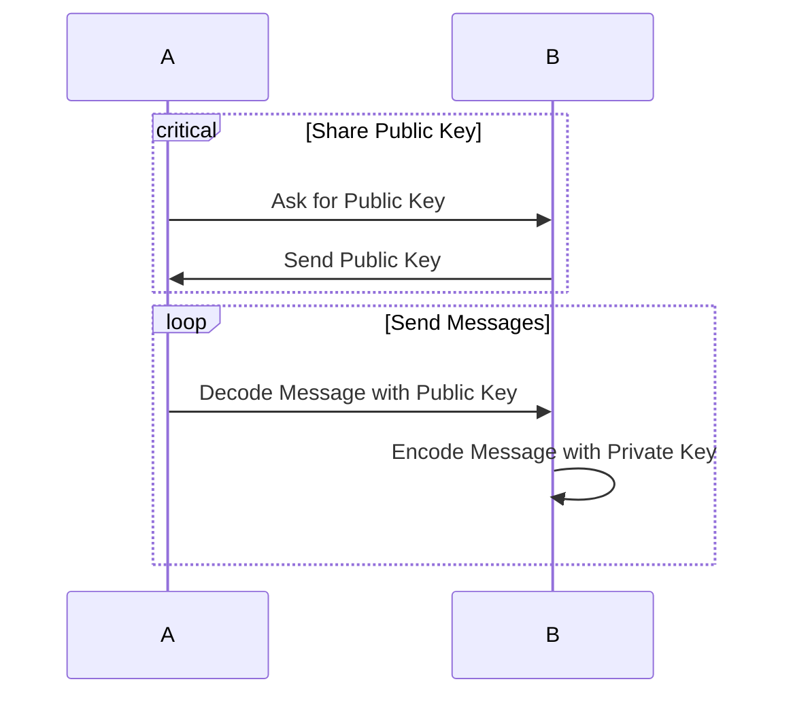
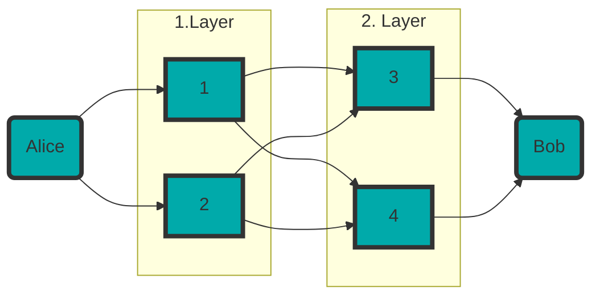

# BeLL
**Thema** Vergleich von privaten Kommunikationsnetzen Tor, Mixnet und VPN anhand einer Simulationsumgebung.
## Literaturrecherche
- https://www.primafelicitas.com/Insights/is-there-a-need-for-network-level-privacy-p2p-tor-and-mixnet/
- https://blog.torproject.org/new-foundations-tor-network-experimentation/
- https://research.torproject.org/tools/
- https://github.com/shadow/tornettools
- https://nymtech.net/
- https://www.researchgate.net/figure/VPN-Simulation-in-Packet-Tracer_fig5_271405994
## Links
- https://cryptpad.fr/code/#/2/code/edit/iVMDOCSEFVWj-Xzb1ALCcDhx/
## Aufbau
### Schlüssel

### Tor

### Mixnet

## Simulation
### Diskrete Simulation
https://users.cs.northwestern.edu/~agupta/_projects/networking/QueueSimulation/mm1.html 