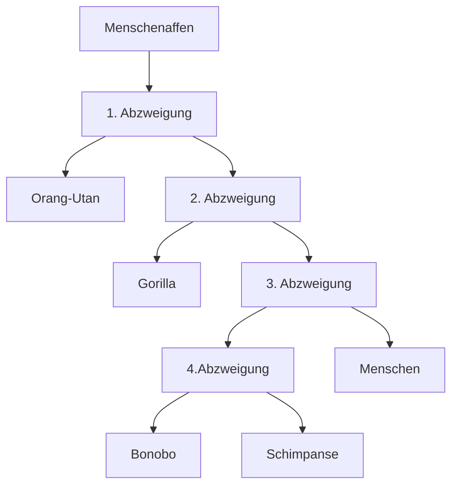

**Ab**

- Komplizierung
	- Entstehung neuer Funktionen
- Differenzierung
- Spezialisierung
	- Passen sich auf bestimmte Fälle an
- Komplizierung
	- Höhere Entwicklung

- - -

**Ab Nr 1**

1. Großer Zeh opponierbar
1. Oft Daumen auch opponierbar
1. FingerAbdrücke
1. Flache Zeh und Fingernägel
1. Augen groß und nach vorne gerichtet

**Ab Nr 2**

**Ab Nr 4**

Der Mensch entstand aus den Menschenaffen. Über verschiedene Abzweigungen ist er mit anderern Menschenaffen wie Orang-Utans, Gorillas oder Schimpansen verwandt. Da Menschenaffen zu den Primaten gehören, stammt der Mensch von den Affen Ab.

**Ab**

Mit der Menschlichen Hand kann man Objekte zwichen dem Daumen und den restlichen Fingern greifen. Ohne Daumen wird es allerdings erheblich schwerer, etwas zu ergreifen. Bekommt man so auch einen Knopf oder den Deckel einer Pflasche nicht zu greifen, ist es dementsprechend auch deutlich schwerer, es zu öffnen.

**Ab Nr 1**

- Artipitheus
	- Aufrechter Gang
	- Größeres
- Artipitheus Afarensis
	- Bewegt sich in Gruppen
	- Pflanzenfresser
- Homo HAbilis
	- Deutlich größeres Gehirn
	- Nutzen erstmals Werkzeuge
	- Assfresser
- Homo Erectus
	- Kulturelle Entwicklun
	- Feuer
	- Verbesserte Werkzeuge
	- Jäger
	- Reduzierte Körperbehaarung
	- Erschließt neue Kontinente
- Homo Neandertalensis
	- Robust
	- Muskulöser
	- Tragen erstmals Kleidung
- Homo Sapiens
	- Besiedelt alle Kontinente
	- Trieft auf den Homo Neander und verdrängt ihn
	- HAben spezialisierte Steinwerkzeuge
	- HAben Kunst
	
**Lb S 117 Nr 2**

* Masai
  * Aus Afrika Stammend
* Inuit
  * Wanderten aus Afrika aus