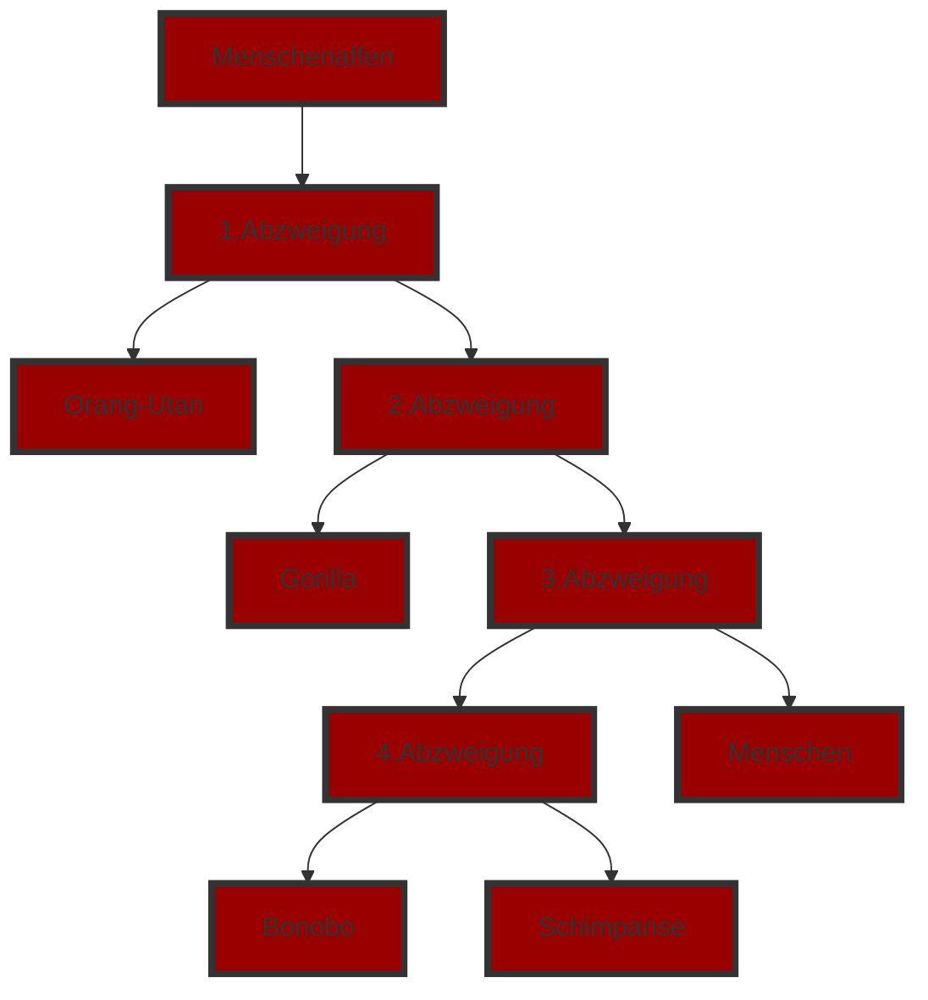

# Anwendung Evolutionsfaktoren Und Entstehung Der Artenvielfalt

Je nach Umweltfaktoren haben die dunklen oder helleren Birkenspanner eine bessere Überlebenschance, was von ihrer Anpassung zur Umgebung abhängt. In Industriegebieten mit einer höheren Luftverschmutzung fallen dunkle Birkenspanner weniger auf, wohingegen in Ländlichen gebieten mit einer niedriegen Luftverschmutzung eher helle Birkenspanner weniger auffallen.

## Evolutionsfaktoren

- Mutation
- Rekombination
- Selektion
- Gendrift
- Isolation

## Evolutionstendenzen

- Komplizierung
- Differenzierung
- Zentralisierung
- Spezialisierung

**AB**

Komplizierung
- Entstehung neuer Funktionen
Differenzierung
Spezialisierung
- Passen sich auf bestimmte Fälle an
Komplizierung
- Höhere Entwicklung

## Homologie

Als Homologie bezeichnet man in der biologischen Systematik und der vergleichenden Anatomie die grundsätzliche Übereinstimmung von Organen, Organsystemen, Körperstrukturen, physiologischen Prozessen oder Verhaltensweisen zweier Taxa aufgrund ihres gemeinsamen evolutionären Ursprungs.

## Analogie

Analogie bezeichnet in der Philosophie eine Form der Übereinstimmung von Gegenständen hinsichtlich gewisser Merkmale. In der Antike wurde der Begriff ursprünglich als Fachausdruck für die Bezeichnung mathematischer Verhältnisse verwendet.

# Die Entwicklung Des Menschen

**AB NR 1**

1. Großer Zeh opponierbar
1. Oft Daumen auch opponierbar
1. Fingerabdrücke
1. Flache Zeh und Fingernägel
1. Augen groß und nach vorne gerichtet

**Ab NR 2**

**AB NR 4**

Der Mensch entstand aus den Menschenaffen. Über verschiedene Abzweigungen ist er mit anderern Menschenaffen wie Orang-Utans, Gorillas oder Schimpansen verwandt. Da Menschenaffen zu den Primaten gehören, stammt der Mensch von den Affen ab.

**AB**

Mit der Menschlichen Hand kann man Objekte zwichen dem Daumen und den restlichen Fingern greifen. Ohne Daumen wird es allerdings erheblich schwerer, etwas zu ergreifen. Bekommt man so auch einen Knopf oder den Deckel einer Pflasche nicht zu greifen, ist es dementsprechend auch deutlich schwerer, es zu öffnen.

**AB NR 1**

- Artipitheus
	- Aufrechter Gang
	- Größeres
- Artipitheus Afarensis
	- Bewegt sich in Gruppen
	- Pflanzenfresser
- Homo Habilis
	- Deutlich größeres Gehirn
	- Nutzen erstmals Werkzeuge
	- Assfresser
- Homo Erectus
	- Kulturelle Entwicklun
	- Feuer
	- Verbesserte Werkzeuge
	- Jäger
	- Reduzierte Körperbehaarung
	- Erschließt neue Kontinente
- Homo Neandertalensis
	- Robust
	- Muskulöser
	- Tragen erstmals Kleidung
- Homo Sapiens
	- Besiedelt alle Kontinente
	- Trieft auf den Homo Neander und verdrängt ihn
	- Haben spezialisierte Steinwerkzeuge
	- Haben Kunst
	
**LB S 117 NR 2**

* Masai
  * Aus Afrika Stammend
* Inuit
  * Wanderten aus Afrika aus

## Out of Africa

Menschen wanderten aus Afrika aus und passten sich an ihre neue Umgebung an. Masai hat einen hohen Melanin-lysann-Gehalt aufgrund der hohen Sonneneinstrahlung, während die Inuit einen geringen Melanin-Gehalt aufgrund der geringen Sonneneinstrahlung haben.

# Wahlpflicht: Rassismus

Rassismus ist eine Ideologie, nach der Menschen aufgrund äußerlicher Merkmale oder negativer Fremdzuschreibungen, die übertrieben, naturalisiert oder stereotypisiert werden, als „Rasse“, „Volk“ oder „Ethnie“ kategorisiert und ausgegrenzt werden.

Rassisten betrachten Menschen, die ihren eigenen Merkmalen möglichst ähnlich sind, meist als höherwertig, während alle anderen (oftmals abgestuft) als geringerwertig betrachtet werden (Chauvinismus). Oft möchten sie einen normalen Verkehr der Gruppen untereinander erschweren (Segregation) und dabei insbesondere die Vermischung durch familiäre Verbindungen und Zeugung von Nachkommenschaft verhindern.

Sozialdarwinismus ist eine sozialwissenschaftliche Theorierichtung,[1] die einen biologistischen Determinismus als Weltbild vertritt. Sie war in der zweiten Hälfte des 19. Jahrhunderts und bis zum Zweiten Weltkrieg sehr populär.[2] Sie interpretiert missbräuchlich Teilaspekte des Darwinismus in Bezug auf menschliche Gesellschaften um und fasst deren Entwicklung als Folge natürlicher Selektion beim „Kampf ums Dasein“ auf.[3][4] 

Die Idee, dass es Menschenrassen gibt, war und ist mit einer Bewertung dieser vermeintlichen Rassen verknüpft. Menschengruppen, die sich etwa aufgrund der Hautfarbe, Augen- oder Schädelform unterscheiden, wurden verfolgt, versklavt und ermordet. Auch heute noch wird der Begriff „Rasse“ im Zusammenhang mit menschlichen Gruppen verwendet. Aber: Die biologischen Unterschiede zwischen allen heute lebenden Menschen sind winzig, das haben weltweit angelegte, genetische Studien gezeigt.
Im menschlichen Erbgut gibt es 3,2 Milliarden Basenpaare – aber bei keinem einzigen Basenpaar gibt es einen einzigen fixierten Unterschied, der zum Beispiel Afrikaner von Nichtafrikanern trennt. Es gibt also nicht nur kein einziges Gen, das solche angeblichen „rassischen“ Unterschiede begründet, sondern noch nicht mal ein einziges Basenpaar.

Zwei zufällige Meschen stimmen zu über > 99 % genetisch miteinander ein.

Alle Menschen stammten aus Afrika.
