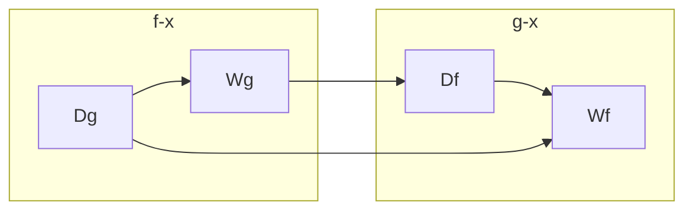

# Geometrie

## Formeln

| Formel                                       | Berechnet                                      |
| -------------------------------------------- | ---------------------------------------------- |
| **Kreis**                                    |                                                |
| $A_k=\frac{d}{2}^2*\pi= r^2*\pi$             | Fläche Kreis                                   |
| $u_k=d*\pi=2r*\pi$                           | Umfang Kreis                                   |
| **Kreisausschnitt**                          |                                                |
| $a=\frac{b}{u_k}*360°=\frac{b}{2r*\pi}*360°$ | Mittelpunktwinkel; Winkel des Kreisausschnitts |
| $A=\frac{\pi*r^2*a}{360°}$                   | Flächeninhalt des Kreisausschnitts             |
| $b=\frac{2r*\pi*a}{360°}$                    | Länge Kreisbogen                               |
| **3D**                                       |                                                |
| $V_{kegel}=(1/3)*\pi*r^2*h$                  | Volumen eines Kegels                           |
| $V_{kugel}=(4/3)*\pi*r^3$                    | Volumen einer Kugel                            |
| $O_{kugel}=4*\pi*r^2$                        | Oberfläche einer Kugel                         |

## Dreieck

$A=\frac{a*h_a}{2}$
$u=a+b+c$

- **Seiten und Punkte**
	- Mittelsenkrechte → senkrechte der Mittelpunkte der Seiten → Schnittpunkt ist der Punkt des Außenkreises
	- Winkelhalbierende → halbieren Winkel → Schnittpunkt ist der Punkt des Innenwinkels
	- Seitenhöhen → Höhe einer Seite → senkrechte einer Seite n zum Punkt N

- Im Rechtwinkligen Dreieck
	- Hypotenuse → lange Seite  
	- Kathete → kurze Seite

## Der Satz Des Pythagoras

In jedem rechtwinkligen Dreieck gilt, dass die Summe der Quadrate der Katheten genauso groß ist wie das Quadrat der Hypotenuse.

$a^2+b^2=c^2$

## Der Höhensatz Des Euklid


## Sinus Und Kosinus

Sinus und Kosinus sind beides periodische Funktionen, die sich im Abstand von $2\pi$ wiederholen.


# Algebra

## Verknüpfung Und Verkettung Von Funktionen

Addition einer Funktion mit einer Konstante verschiebt den Graphen der Funktion entlang der y-Achse um den Wert der Konstante.



```py
f = lambda x: x ** 2
g = lambda x: 0.5 * x

h = lambda: x: g(f(x))
```

### Verknüpfung Und Verkettung: Addition

Sei $f(x)$ und $h(x)$ Funktionen, dann ist $g(x)=f(x)+h(x)$ wieder eine Funktion und es gilt: Der Graph von $g$ ergibt sich durch Addition der Werte von $f$ und $h$ an jeder Stelle $x$.

### Verknüpfung Und Verkettung: Subtraktion

Sei $f(x)$ und $h(x)$ Funktionen, dann ist $g(x)=f(x)-h(x)$ wieder eine Funktion und es gilt: Der Graph von $g$ ergibt sich durch Subtraktion der Werte von $f$ und $h$ an jeder Stelle $x$.

# Storastick
