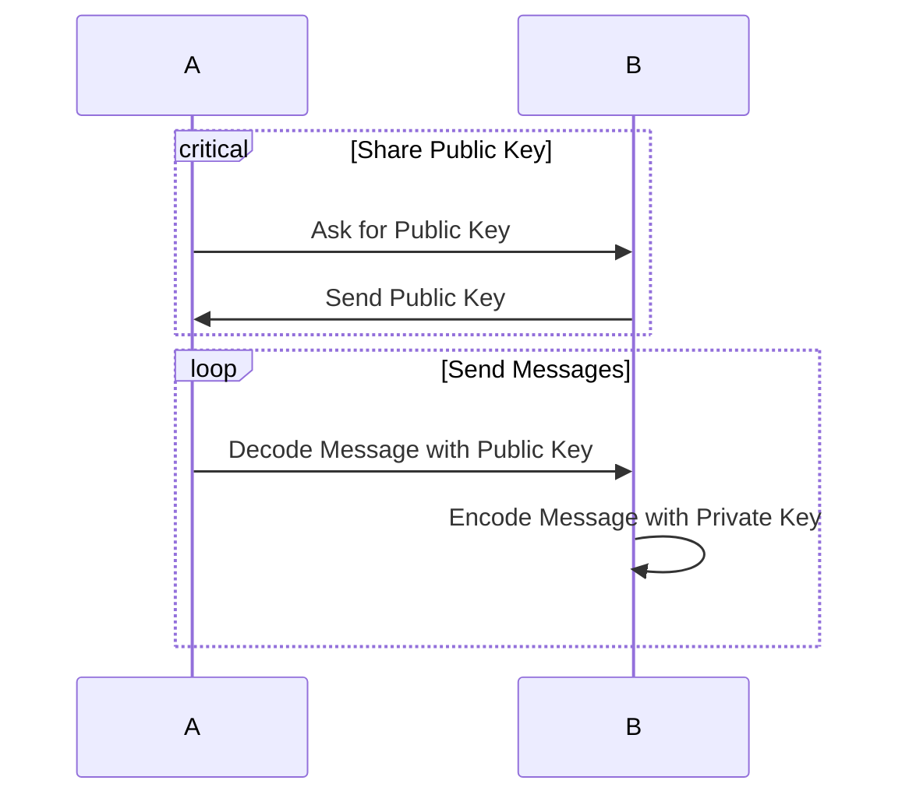
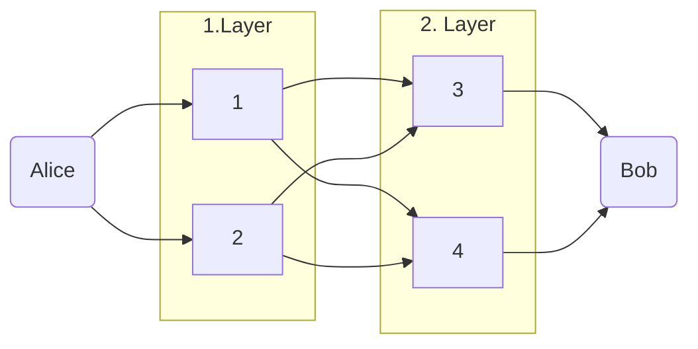

Vergleich von privaten Kommunikationsnetzen Tor, Mixnet und VPN anhand einer Simulationsumgebung.

# Recherche

## Systeme^[https://www.inforsec.org/wp/?p=960]

- Mixes
- DC-Net
- Anonymizer
- Crowds
- Onion Routing
- Mixminion
- Tor

### Tor^[https://www.researchgate.net/publication/320663877_Anonymous_Communication_on_the_Internet#pf9]

Onion Routing

## Strategien

- Blacklisting
- Whitelisting

## Simulation^[https://www.twi-global.com/technical-knowledge/faqs/faq-what-is-simulation]

- Diskrete Simulation: Modelling a system as it progresses through time,
- Dynamik Simulation: Modelling a system as it progresses through space
- Process Simulation: Modelling physical interactions between two or more systems

### AnoA^[https://eprint.iacr.org/2014/087.pdf]

Framework for anonymous communication protocols

# Diagramme

## Schlüssel

## Tor

## Mixnet

