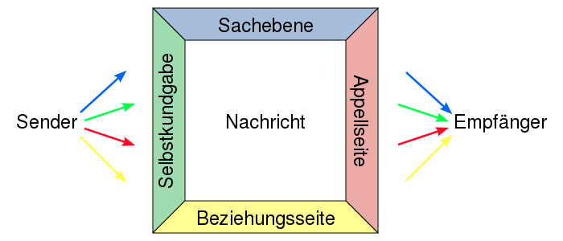

# Inhalt

## Biografie

1. Friedemann Schulz von Thun wurde 1944 geboren
1. Er studierte in Hamburg Psychologie, Pädagogik und Philosophie
1. machte sein Diplom 1971
1. Promovierte 1973 bei Reinhard Tausch und Inghad Langer über Verständlichkeit bei der Wissensvermittlung
1. Er machte 1975 eine Habilitation, welche ihn zu seiner Professsur für Pädagogische Psychologie in Hamburg von 1976 bis 2009 führte
1. Gleichzeitig führ er Kommunikationstrainigs für Lehrer und Führungskräfte von 1971 bis heute durch

### Preise

1. 2001: Integrationspreis für die Verbindung von Wissenschaft und Alltagspraxis
1. 2001: Großen Georg-Gottlob-Preis in Würdigung für sein Lebenswert
1. 2005: Preis des Fachbereiches Psychologie der Universität Hamburg für herausragende Lehre
1. 2009: Live Achievement Award der Deutschen Weiterbildungsbranche für sein Lebenswerk

## Kommunikationsquadrat: Erläuterung an Einem Beispiel

- besteht aus Sender (mit vier Schnäbeln) und Empfänger (mit vier Ohren)
- __Ebenen der Kommunikation:__
	- Sachebene: Worüber ich dich informiere
	- Selbstkundgabe: Was ich von mir offenbare
	- Beziehungsseite: Wie ich zu dir stehe, was ich von dir halte
	- Appellseite: Was ich von dir will
- beruht auf der Annahme, dass jede Äußerung nach vier Aspekte interpretiert werden kann
- 

## Kommunikationsstile

-   Der bedürftig-abhängige Stil 
	-   „Dir gelingt alles immer viel besser ...“ 
	-   Können Hilfe annehmen 
	-   Kein Selbstvertrauen 
-   Der helfende Stil 
	-   Strahlen Souveränität und Hilfsbereitschaft aus 
	-   Große Hilfsbereitschaft 
	-   Können nicht nein sagen 
-   Der selbstlose Stil 
	-   Große Hilfsbereitschaft 
	-   Aufbürdung der Arbeit anderer 
	-   Können nicht eigene Wünsche/Bedürfnisse äußern 
-   Der aggressiv-entwertende Stil 
	-   Erhöht sich selbst, indem er andere kleiner macht 
	-   Können Kritik offen selbst vortragen 
	-   Kränkung anderer erschweren das miteinander 
-   Der sich beweisende Stil 
	-   Müssen ständig seinen eigenen Wert beweisen 
	-   Ist sich seiner Kompetenzen bewusst 
	-   Angeberei macht ihn unsympathisch 
-   Der bestimmend-kontrollierende Stil 
	-   „Das muss so, und nicht so, erledigt werden!“ 
	-   Klare Aussagen/Regeln 
	-   Kaum Spielraum für Neues 
-   Der sich distanzierende Stil 
	-   Halten einen Abstand zwischen sich und anderen 
	-   Emotional unabhängig 
	-   Mangelnde Empathie 
-   Der mitteilungsfreudig-dramatisierende Stil 
	-   Selbstdarstellung 
	-   Wird fantasievoll und kreativ erlebt 
	-   Unterhaltungen gestalten sich eher als Monolog

## Stärken Und Schwächen Des Modells

Das Kommunikationsquadrat zeigt verschiedene Interpretationsmöglichkeiten vereinfachter verbaler Kommunikation. Da allerdings nur etwa 7% unserer Kommunikation verbal stattfindet, ist es unvollständig und nicht allgemein anwendbar.

# Quellen

- [Schulz-von-Thun](http://www.schulz-von-thun.de)
- [Wikipedia](https://de.wikipedia.org/wiki/Friedemann_Schulz_von_Thun)
- [Preisträger](http://www.life-achievement-award.de/preistrager_2009.html)
- [Web-Archiv](https://web.archive.org/web/20161030161538/http://www.schulz-von-thun.de/index.php?article_id=107)
- [Gegen Vergessen](https://www.gegen-vergessen.de/verein/preise/preis-gegen-vergessen-fuer-demokratie/2021/)
- [Wortwuchs](https://wortwuchs.net/vier-ohren-modell/)
- [Wikipedia](https://de.wikipedia.org/wiki/Kommunikationsstile_nach_Schulz_von_Thun)
- [Hubspots](https://blog.hubspot.de/sales/kommunikationsmodelle)
