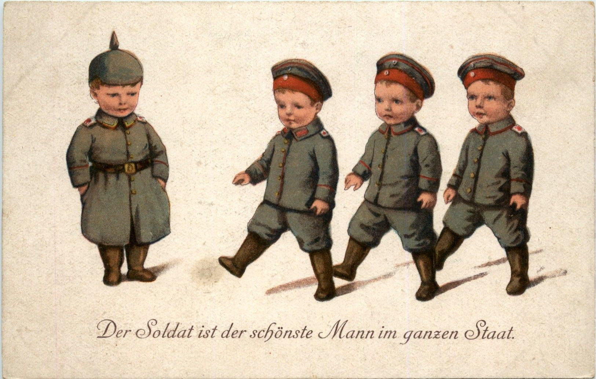

## Nationalismus

### Alldeutscher Verband^[https://www.dhm.de/lemo/kapitel/kaiserreich]

- Agitationsverband
→ Agitation (lateinisch agitare: „aufregen, aufwiegeln“) ist die meist aggressive Beeinflussung Anderer in politischer Hinsicht
- Verband, der für expansionistische, pangermanische, militaristische, nationalistische sowie rassistische und antisemitische Politik warb

### Der neue Reichsnationalismus^[https://www.bpb.de/themen/kolonialismus-imperialismus/kaiserreich/138915/nation-und-nationalismus/]

Nach der Reichsgründung war es erst einmal notwendig, die überkommenen partikularstaatlichen Identifikationen durch einen übergreifenden Reichsnationalismus wenn nicht zu ersetzen, so doch zu ergänzen und zu überwölben. Dafür bot sich an erster Stelle das Kaisertum als Bezugspunkt an, ergänzt durch die militärischen Erfolge in den Reichsgründungskriegen und die Identifikation mit dem "Reichsgründer" Otto von Bismarck. Wegen der preußischen Vorrangstellung im Reich erhielt der deutsche Nationalismus nicht nur eine borussische, sondern zugleich auch eine ausgesprochen protestantische Prägung, die dem neuen Nationalstaat einen geradezu heiligen Charakter verleihen konnte.

### Wilhelminische Radikalisierung des Reichsnationalismus

In der wilhelminischen Phase des Kaiserreichs kamen zwei neue Faktoren hinzu, die den Reichsnationalismus weiter radikalisierten: Im Zeichen des Hochimperialismus ging die Reichspolitik von Konsolidierung und eher zauderndem Kolonialerwerb nun zu einer aggressiven "Weltpolitik" über. Und sie wurde dabei von neuen, bürgerlich geprägten Agitationsverbänden angetrieben, die die monarchische Regierung von rechts propagandistisch unter Druck zu setzen versuchten und dabei eine radikalen Nationalismus entwickelten. Bereits 1887 war die Deutsche Kolonialgesellschaft gegründet worden, es folgten der Deutsche Ostmarkenverein, (1894), der Deutsche Flottenverein (1898), der Reichsverband gegen die Sozialdemokratie (1904) und schließlich der Deutsche Wehrverein (1912). Einen besonders radikalen, pangermanisch-völkischen Nationalismus vertrat bereits seit 1891 der Alldeutsche Verband, dessen Vorsitzender Heinrich Class 1912 unter dem Titel "Wenn ich der Kaiser wäre" eine programmatische Schrift veröffentlichte, die mit ihren Forderungen nicht nur nach einer expansionistischen Außenpolitik, sondern auch nach der Schaffung einer homogenen, national, politisch und rassisch einheitlichen Volksgemeinschaft eindeutig einen präfaschistischen Charakter aufwies.

### Nationalismus und Sozialdarwinismus

Als typisch imperialistische Legitimationsideologie gewann schließlich auch der Sozialdarwinismus spezifisch nationalistische Ausprägungen. Nationale Stärke und Kampfbereitschaft sollten die Nation in der als notwendig begriffenen Auseinandersetzung mit anderen Nationen auszeichnen. Der pensionierte Planungsleiter im Preußischen Generalstab Friedrich v. Bernhardi etwa propagierte in seinem Bucherfolg "Deutschland und der nächste Krieg" nicht nur eine aggressive Politik des Kaiserreiches, sondern er bestimmte Krieg zugleich als eine "biologische Notwendigkeit" für die Nation: "Ohne den Krieg aber würden nur allzu leicht minderwertige und verdorbene Rassen durch Masse und Kapitalmacht die gesunden, kernkräftigen Elemente überwuchern, und ein allgemeiner Rückgang müßte die Folge seine. In der Auslese besteht die Schöpferkraft des Krieges."

## Militarismus

### Feinde

Das Militär wird nach der Reichsgründung 1871 mit der Idee der Deutschen Nation zur neuen Identität des Kaiserreichs. Grund hierfür ist das militarisierte Preußen und die kriegerische Entstehung des Reiches.

### Aufrüstung

### Rekrutierung^[https://www.lehrerfreund.de/schule/1s/bismarckzeit-militarismus-arbeitsblatt/2261]

> **Der Sozialdemokrat Liebknecht über das militärische Wesen der Schule:**^[Aus Wilhelm Liebknecht: Wissen ist Macht. Göttingen 1887, S. 21 und 25]
> 
> Der dressierende Schulmeister und der drillende Unteroffizier sind die beiden Hauptpfeiler des heutigen Staates … Neben dem drillenden Unteroffizier hat der dressierende Schulmeister … bei Königgrätz 1866 gesiegt … Der Unteroffizier ist die Voraussetzung des Schulmeisters. Die Volksschule ist die Vorschule der Kaserne, die Kaserne die Fortbildungsschule der Volksschule. Ohne den Schulmeister keinen Unteroffizier.

- Abhaltung vieler Paraden
- Kindern werden Matrosenuniformen angezogen
- Wehrpflicht für alle jungen Männer von 20 bis 25 Jahren^[https://www.verfassungen.de/preussen/gesetze/kriegsdienstpflichtgesetz14.htm]

### Bevorzugung^[https://simpleclub.com/lessons/geschichte-militarismus-im-deutschen-kaiserreich]

- Privilegien für Soldaten
- Nationalfeiertag ist Sedantag (=Erinnert an Schlacht von Sedan gegen Frankreich)
