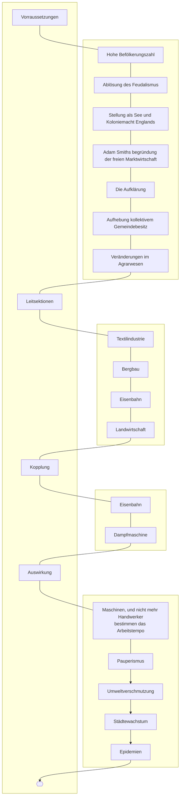

---
tags:
- topic/history
---

## 01.09.2022

- Merkantilismus
- Dampfmaschinen
- Arbeitnehmerrechte
- Streiks
- Umweltverschmutzung
- Gewerkschaften
- Verstädtisierung
- Wohnungsmangel
- Industriegebiete
- Proletariat
- Aristrokraten
- Mono- u. Oligopole
- Arbeitsteilung
- Automatisierung
- Mechanisierung
- Gesellschaftsteilung
- Export
- Import
- Aktiengesellschaft
- Kommunikationsbeschleunigung
- Handelsgesellschaften
- Heizungssysteme
- Eisenbahn
- Urbanisierung
- Pauperismus

## 08.09.2022

## 15.09.2022

- **Aufgaben des Staates**
	1. Angriffe von außerhalb Abwenden
	1. Jedes Mitglied der Gesellschaft vor Unterdrückung schützen
	1. Öffentliche Einrichtungen zu gründen und zu unterhalten

Smith geht geht bei seinem kritischen Egoismus davon aus, dass jeder dadurch, dass er sein eigenes Kapital möglichst gewinnbringend für sich einsetzt, gleichzeitig auch das Gemeinwohl gefördert wird. So würde nach ihm durch den größtmöglichen Einsatz des Einzelnen gleichzeitig auch das Volkseinkommen steigen, was allen zu gute kommen würde. Dabei stößt dies aber auf das Problem, dass der größtmögliche Einsatz des Einzelnen keinesfalls auch dem Gemeinwohl zugute kommt, da der Einzelne das gesamte Kapital auch nur für sich behalten kann. Als ein aktuelles Beispiel ist Amazon einer der größten Firmen, die kaum Steuern zahlt und ihrer Mitarbeiter ausbeutet.

|                                  | Wirtschaftsliberalismus                            | Merkantilismus                                                                    |
| -------------------------------- | -------------------------------------------------- | --------------------------------------------------------------------------------- |
| Rolle des Staates                | „Nachtwächterstaat“                                | Starke Besteuerung und Regulierung von Zoll, Import und Export                    |
| Ziel des Staates                 | Förderung des „Allgemeinwohls“                     | Steigerung der nationalen Wirtschaftskraft und Erhöhung der staatlichen Einkünfte |
| Organisation der Wirtschaftsform | „freie“ Marktwirtschaft, Konkurrenz und Wettbewerb | zentrale Lenkung durch den Staat                                                  |
| Preisbildung                     | Angebot/Nachfrage                                  | Staatlich festgelegt                                                              |
| Arbeitsbeziehung                 | Lohnpreisbildung                                   | Staatliche Eingriffe                                                              |

## 22.09.2022

Die Karikatur „Capital and Labour“, welche Anonym 1843 in der englischen Satirezeitschrift Punch veröffentlicht wurde, handelt von dem Kapital und der Arbeit während der Industrialisierung.

Die Karikatur ist in zwei Teile geteilt: Oben sind gut aussehende Herrschaften zusehen, wie sie von Personen mit Getränken und Früchten versorgt werden. Unten hingegen sind viele zusammengepfercht Personen, jung, alt, und hässlich dazu, abgebildet. Im Hintergrund sind Menschen abgebildet, die sich durch Tunnel graben. Gleichzeitig befinden sich in einem getrennten Raum Britannia und Eros.
Dargestellt ist hier die finanzielle Ober- und Unterschicht. Oben genießt die Oberschicht ihr Leben, welches sie durch die Ausbeutung ihrer Angestellten finanzieren. Die Unterschicht hingegen muss in den Minen arbeiten, um die Industrialisierung voran zu treiben, und lebt gleichzeitig unter den schlechtesten Bedingungen. Gleichzeitig, schauen Eros und Britannia, durch das Schlüsselloch zu den Bürgern hinüber. Die Bevölkerung ist hingegen weggeschlossen worden von Eros und Britannia.
Kritisiert wird somit der damalige Zustand des Proletariats.

„Capital and Labour“ ist durchaus für ihre Zeit repräsentativ, da sie den Pauperismus während des 19th Jahrhunderts widerspiegelt, sowie die wichtige Säule der Industrialisierung, den Kohle- und Eisenabbau, darstellt.

## 29.09.2022

Aus der Sicht eines Wirtschaftsliberalisten ist das preußische Landrecht zu Verurteilen, da es das Ständesystem begünstigt. Da dadurch alles starr und festgefahren ist, wird jegliche Chance auf einen fairen, wettkampforientierten Markt genommen

- - -

- __Dracke:__
	- da es durch die Gewerbefreiheit keine Prüfungen mehr gibt, verbessern viele nicht mehr ihre Fähigkeiten
	- der etablierte Gewerksmann verbessert nicht seine Fähigkeiten, sondern studiert Betrug und Täuschung
	- wer keine Lust hat sich unterzubringen oder sich weiterzubilden, beginnt ein Gewerbe
	- viele beginnen mehrere Gewerbe, ohne das sie vom jeweiligen auch nur Ahnung haben
	- da sie keine Ahnung haben, scheitert es meistens, und treibt Individuen in den Ruin

## 2022-11-10

Die „Soziale Frage“ beschreibt das Massenelend, entstanden durch die sinkenden Löhne und der Abhängigkeit vom Arbeitgeber. 
Ursachen für die soziale Frage waren der Umbruch von der feudalen Agrargesellschaft zur kapitalistisch bestimmten Industriegesellschaft, Auflösung der traditionellen patriarchalischen Ordnungen keine soziale Sicherung durch Großfamilie und die Landflucht und die Bevölkerungsexplosion, der Niedergang der Agrar- und Zunftverfassung.
Auch in England haben Landflucht und die Bevölkerungsexplosion zur Armut geführt. Der Pauperismus in England kann sehr gut mit der Situation in Deutschland verglichen werden. Allerdings verlief der Umbruch in England wesentlich schneller als in Deutschland.
Resultierende Folgen sind Massenarmut, Niedriglöhne, Städtewachstum, Epidemien, fehlende Ausbildung, Wohnungsmangel,  sowie Frauen und Kinderarbeit.

## 2022-11-24

- Kathedersozialismus fordert Milderung der Klassengegensätze
- Genossenschaften wurden gegründet
- christliche Soziallehre verbreitet
- Sozialpolitik Bismarcks bringt die Sozialversicherung mit ein

- - -

## 2022-12-08

1. Nennen Sie die unterschiedlichen „Parteien“ und Strömungen sowie deren Forderungen (Vorstellungen) des „ewigen“ Friedens (M1).
	- Der Staatenbund der Bundesversammlung möchte einen eigenen Deutschen Bund begründen. Als Vorbild war hierfür die Französische Revolution. Ziel war die Begründung eines eigenen deutschen Staates. Dabei wollten die „liberalen“ nur einen Staat mit Monarchie und Parlament, sowie ein Wahlrecht für die Reichen, die „Demokraten“ oder „Radikalen“ forderten hingegen Gleichheit für alle Mitglieder und allgemeines Wahlrecht für Männer. Die „Heilige Allianz“ aus Preusen, Russland und Österreich wollten Restauration (Wiederherstellung alter Machtverhältnisse).  
1. Erklären Sie sowohl das Zitat Ludwig Rödigers (»alles ist anders gekommen, als wir erwartet haben [nach Leipzig]«) als auch die Bücherverbrennungen auf dem Wartburgfest (M2)! 
	- Rödiger drückt mit seinem Zitat die Unzufriedenheit über die Zustände und Erfolge der metternichschen Reaktion zum Ausdruck. Bei der Bücherverbrennung werden die absolutistische Symbole, und somit das alte System verbrannt.  
1. Ordnen Sie das erlassene Turnverbot (M4) in den geschichtlichen Zusammenhang ein! 5. Bewerten Sie die „Karlsbader Beschlüsse“ (M5)! 
	- Das Turnverbot 1819 kam durch die Ereignisse bei Wartburgfest. Beim Wartburgfest kam es zu heftigen Auseinandersetzungen. Das Turnen wurde eingeführt, um Disziplinen bei zu bringen. Jetzt wurde es jedoch verboten, weil der Schrifsteller August von Kotzbue ermordet wurde und daraufhin der preußische König das Turnier verbieten ließ. 

## 2022-12-15

1. Nennen Sie Kennzeichen, tragende Kräfte und Forderungen der Epoche des Vormärz (M1)! 
	- Deutsche Epoche zwischen 1830 und 1848
	- Äußerer Frieden und gewaltsame erzwungene innere Ruhe
	- Ursachen durch »Metternichsche System« und Pauperismus
	- Forderung nach Schwurgerichten, Pressefreiheit, Bauernbefreihung und Reformen frühkonstitutioneller Verfass
1. Zeigen Sie Anlass und Ursache für die Julirevolution 1830 in Frankreich auf (M2 + M3)! 
	- Auflösung der Kammer, Aufhebung der Pressefreiheit, Abänderung des Wahlrechts → Julirevolution
	- Restaurationspolitik König Karls X.
1. Erklären Sie, warum der Funke der Revolution auch auf die Mittelstaaten des Bundes überspringt (M3)! 
	- Stürzung König Kalrs X.
	- Julirevolution in Frankreich
1. Bewerten Sie die in M4 genannten Ereignisse! 
	- 
1. Erörtern Sie mögliche Gründe, warum es Friedrich Wilhelm IV. nicht gelungen ist, die nationale Gesinnung mit der Monarchietreue zu verknüpfen!
	- Friedrich Wilhelm war nicht nationalistisch
	- Er glaubt an Gottesgnadentum
	- Mit seiner Versöhnungspolitik versuchte er nur grundlegend die Bedürfnisse abzudecken.

## 2023-01-05

1. Erläutern Sie, warum Karl Marx und Friedrich Engels den Deutschen das das Zusammengehen mit der Bourgeoisie (M3) empfehlen! 
1. Bewerten Sie die in M4 genannten Handlungen Friedrich Wilhelms

## 2023-01-26

1. Beschreiben Sie, wie sich das Vorparlament legitimierte (M1)!
	- Die Heidelberger Versammlung, aud der sich 51 Demokraten und Liberalen tragen, wählte den Siebener-Ausschuss. Das Vorpalarment kam durch eben dieses Siebener-Ausschusses zustande. Somit wurde das Vorparlament durch die Revolution legitimiert
1. Ordnen Sie den Vorwurf, das Parlament sei nur eine „Quatschbude“ ein!
	- Der Vorwurf, das Parlament sei nur eine "Quatschbude", kam von den Kritiker der Linken Abgeordneten. Sie bemängeln, dass die Nationalversammlung vor allem aus dem Bildungsbürgertum stammte, und andere Teile, wie zum Beispiel Landwirte (6,4 %), Frabrikanten oder Kaufleute kaum bis garnicht vertreten waren. Dieser Vorwurf war jedoch nicht außsschlaggebend, da vor allem regionale und politische Orientierung, und nicht der Berufsgruppen die Nationalversammlung prägten.
1. Arbeiten Sie aus M3 i.V.m. M2 u. M5 heraus, welche politische Strömung sich im Hinblick auf die Reichsverfassung durchsetzte und ermitteln Sie die Gründe hierfür!
	- Im Hinblick auf die Reichsverfassung setzte sich das „Rechte Zentrum“, bestehend aus vor allem dem Kasino und Weidenbusch, durch. Der Grund hierfür waren, dass das rechte Zentrum die konstitutionelle Monarchie mit einem Parlament und einem erblichen Kaiser als Staatsoberhaupt befürwortete. Da das Casino selbst die stärkste Gruppe war und ein Großteil der Abgeordneten Beamten waren, waren keine revolutionären Forderungen zu erwarten.
1. Ermitteln Sie aus M4 i.V.m. M3 u. M5 und ihren bisherigen Kenntnissen Gründe für das Scheitern der „großdeutschen Lösung“! 
	 - Die „großdeutsche Lösung“ ist deshalb gescheitert, weil der Führungsanspruch sowie die Konflikte zwischen Preußen und Östterreich eine deutsche Einheit verhindert haben. Der österreichische-preußische Dualismus als auch die Schlesischen Kriege, sowie die Spannungen in der Religion zwischen dem katholischen Norden und dem protestantischen Süden. Hinzu kommt, das Österreich damals aus vielen verschiedenen Volksgruppen bestand und durch eine Großdeutsche Lösung diese Teile verloren hätten.
1. Bewerten Sie unter Einbezug des Darstellungstextes M5 die „Paulskirche“(Parlament/Quatschbude)!
	- Die „Paulskirche“ kann sowohl positiv als auch negativ gesehen werden. Die Nationalversammlung ist mit der Schaffung einer Nation und einer Einheit gescheitert. Durch die anspruchsvolle Grundrechdebatte hatten sie hierfür schlichtweg zuviel Zeit verloren. Da sie allerdings bei der Schaffung einer Nation gescheitert sind, hatten sie somit auch die Bürgerechte verloren, für die sie gekämpft hatten. Doch da die Grundrechte, die verabschiedet wurden, noch die Grundlage für die Weimarer Reichsverfassung und das Grundgesetzt bildeten, kann die „Paulskirche“ wohl kaum als „Quatschbude“ bezeichnet werden. Da ihre Entscheidungen aber auch keine Wirkung gezeigt haben und sie nichts wirklich direkt verändern konnten, können sie auch kaum ein anerkanntes Parlament sein.

## 2023-03-16

- Kaiserreichtsgründung 1871
- Proklamation von Willhem I. zum Deutschen Kaiser im Spiegelsaal des Schlosses von Versailles
- Gemälde von Anton von Werner
- Verschiedene militärische Angehörige salutieren vor Wilhelm I.
- Rechts steht erhoben Wilhelm I. neben seinen hohen Abgeordneten
- Alle anderen stehen unter ihm

In der Paulskirche ging es um eine Vereinigung Deutschlands, in dem jeder die selben rechte hat und wählen kann. Dem entgegen steht das Kaiserreicht, welches zwar auch vereint ist, jedoch einen Monarchen und ein starkes Militär hat.

- - -

- **Eisen und Blut**
	- Monarchie stärken
	- Kritik am Liberalismus
	- Kritik an der Presse
	- Grenzen sollen durch das Militär erweitert werden

- - -

1. 1864 hat Österreich-Preußen Dänemark angegriffen
2. Dann haben Preußen und Verbündete 1866 Krieg gegen Österreich und die übrigen Staaten geführt
3. Danach wurde Preußen 1870/1871 nach Westen hin erweitert, durch die Belagerung französische Stätte und Grenzregionen

- - -

- **Der Deutsch-Dänischer Krieg**
	- Preußen und Österreich gegen Dänemark
	- Herzogtümer Schleswig und Holstein sollte dänisch werden
	- Dänemark verlor, da Preußen und Österreich moderner Waffen und besser Organisiert waren.
	- Dänemark hat ein drittel seiner Fläche verloren
