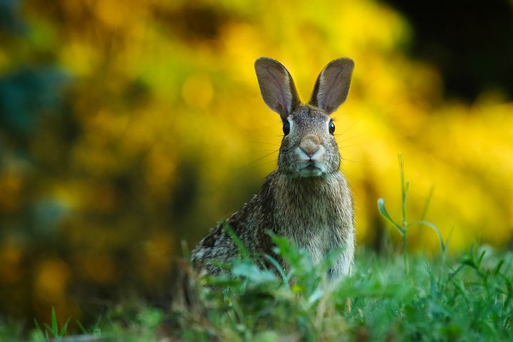

# Aufgabenstellung

Abstrahiere die Fotovorlage so, dass wesentliche Elemente des Werkes erhalten bleiben.

# Umsetzung

Als Vorlage für die Umsetzung diente die Fotovorlage eines Hasen. Ziel war es, das Bild so zu abstrahieren, dass nur die wesentlichen Elemente erhalten bleiben. Die Farbe wurde mit einem Spachtel schichtweise auf ein DIN A3 Blatt aufgetragen. Zuerst wurde der Hintergrund aufgetragen, der aus den verschiedenen Lichtverhältnissen besteht.
Darauf wurde der Hase mit brauner Farbe gemalt.  Die verschiedenen Fellpartien wurden mit helleren und dunkleren Brauntönen dargestellt. Für mich waren vor allem der flauschige Körper und die Ohren die hervorstechenden Merkmale. Die Augen und die Pfoten wurden bewusst weggelassen. Die Augen wurden weggelassen, weil sie im Verhältnis zum Rest des Körpers relativ klein waren. Die Füße wurden weggelassen, da sie durch das Gras ohnehin kaum sichtbar waren und mit dem Fell verschmolzen. Zuletzt wurden die Pflanzen in verschiedenen Grüntönen aufgetragen.

# Reflexion

Im Prozess habe ich festgestellt, was für mich einen Hasen ausmacht, und auf welche Details ich vor allem Wert lege. So denke ich, dass es mir gut gelungen ist, den Hasen selbst kennzeichnen.

Was ich jedoch gerne noch verbessern würde, währe die Abstufungen der Farben. So empfinde ich, dass die Abstufungen im Fell kaum einen Kontrast ergeben und so nur schwer ersichtlich sind. Das Gleiche gilt für die Lichverhältnisse im Hintergrund. Ein weiterer Punkt ist, dass ich bei einem weiteren Versuch den Hasen etwas größer malen würde, damit das Blatt besser ausgefüllt ist.
