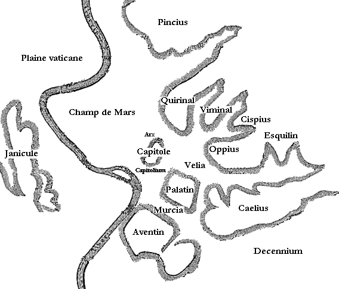
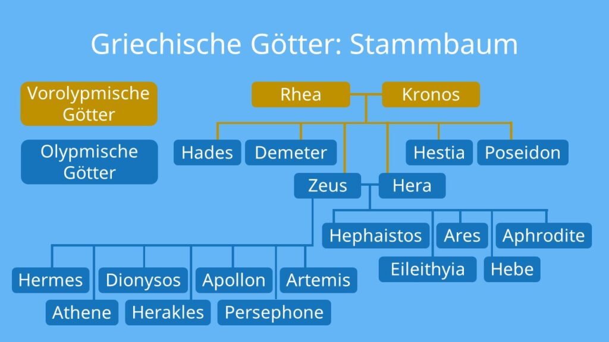

# Bedeutung/Herkunft

- Mars wurde Mamars, Marspiter, latinisch Mavors und etruskisch Maris genannt
- In den Nordeuropäischen Regionen: **Tyr → Tiw → Tuesday → Diestag**
- Mars Silvanus war ursprünglich ein Vegetationsgott

# Geschichte

- war bekannt als **Kriegsgott**
- galt auch als **Agrargottheit**
- er begleitete die Soldaten in die Schlacht
- seine Priester waren die **Flamen Martialis**
- die Flamen waren die Einzel- und Opferpriester einer gewissen Gottheit
- Kulthandlungen wurden von den **Salii Palatini** durchgeführt
- diese waren römische **Waffentanzpriester**
- seine Söhne waren **Romulus** und **Remus**
- er ist der **Stammvater** und **Schutzherr** von Rom
- mit dem römischen Hauptgott **Iuppiter** und **Quirinus** bildete er die alte patrizische Göttertrias.
- Mars war auf dem **Campus Martius** (Marsfeld) geweiht, wo das Herr vor der Stadt aufmarschierten
- 
- zu seinem Ehren errichtete Kaiser Augustus (**Gaius Octavius)** dem Mars Ultor einen Tempel für den Rächer des Mordes an Caesar
- 

# Griechisch

- das griechische Äquivalent war **Ares**
- 
- die Geschichte des Gottes ist fast komplett an ihm angelegt
- 

# Heutzutage

- der rote Planet **Mars** ist nach ihm benannt
- wenn etwas einen eindeutig kriegerischen Zusammenhang hat, spricht man heute noch von „**martialisch**“
- der Name **Martin** wird von „martialisch“ abgeleitet
- Ruinen des Temples und des Marsfeldes kann man noch heute finden

# Quellen

## Textquellen

- [Wiki](https://de.wikipedia.org/wiki/Mars_(Mythologie))
- [Forum Traiani](https://www.forumtraiani.de/mars-roemische-goetter/)
- [Grin](https://www.grin.com/document/95253)
- [dewiki](https://dewiki.de/Lexikon/Mars_(Mythologie))
- [Deutschland Funk](https://www.deutschlandfunk.de/namen-fuer-mars-100.html)

## Bildquellen

- [Ares](https://de.wikipedia.org/wiki/Datei:Ares_Ludovisi_Altemps_Inv8602_n2.jpg)
- [Marsfeld](https://de.wikipedia.org/wiki/Campus_Martius#/media/Datei:Planrome_collinesetplaines.png)
- [Stammbaum](https://d1g9li960vagp7.cloudfront.net/wp-content/uploads/2021/11/Griechische-G%C3%B6tter_Stammbaum-1024x576.jpg)
- [Mars Fresko](https://encrypted-tbn0.gstatic.com/images?q=tbn:ANd9GcSblNXGaUTjM9loB9tvDII-lWgrsgTGbNvsMLYbeeyethgE0oIve4iVrOHA9ce3u-lHl3o&usqp=CAU)
