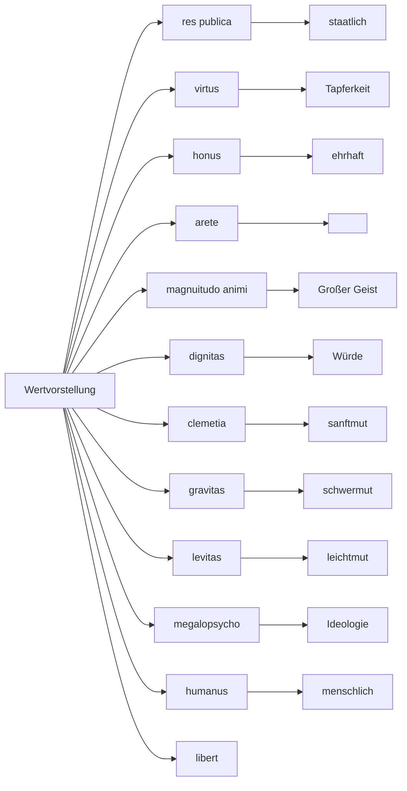

---
tags:
- topic/language
---

# 2022-09-08

|   a-K    |  e-K   | Kons-K | Kurz i-K | i-Konj |
|:--------:|:------:|:------:|:--------:|:------:|
|  amare   | movere | ponere |  capere  | audire |
|  rogare  | monere | agere  |          |        |
| salutar  | videre | petere |          |        |
| laborare |        |        |          |        |

| ponere  | movere  | capere |
| ------- | ------- | ------ |
| pono    | movo    |        |
| pones   | moves   |        |
| ponet   | movet   |        |
| ponemos | movemos |        |
| ponetis | movetis |        |
| ponent  | movent  |        |

# 2022-09-12

| Latein   |      Deutsch |
|:-------- | ------------:|
| discere  |       lernen |
| docere   | unterrichten |
| portare  |      bringen |
| ludere   |      spielen |
| audire   |        hören |
| narrare  |     erzählen |
| moustare |       zeigen |
| stare    |       stehen |
| tedire   | zurück gehen |
| videre   |        sehen |
|visitare|beobachten|

 - **Wichtig:**
	- hortus --> Ehre
	- virtus --> Tapferkeit
	- dignitas --> Würde
	- fides --> Treue

Durch viele Jahre war die Macht der römischen Bürgerschaft gewachsen; viele Stämme Italiens gehorrschten dem römischen Volk. Aber mächtige Stadtstaaten Groß-Griechenlands, wie zum Beispiel Tarentum, Messana, Syracusae wollen der Römischen Befölkerung nicht gehorrschen; denn sie wollten lieber in Freiheit leben. Beonders Terentini wollten lieber mite den Römern Krieg führen, als in Freiheit zu leben.

# 2022-09-15

1. expectare
1. intrare
1. cessare
1. canare
1. ambulare
1. vocare
1. laborare
1. spectare
1. rogare
1. portare
1. narrare

# 2022-09-19

Plinus grüßt seinen Sura

Der Philosoph Athendorus kam nach Athen, las das Angebot, und nachdem er den Preis hörte, verdächtigte er ihn, weil er ihm verdächtig gering vorkam, er erfuhr alles und mietete es trotzdem. Es wird Abend, Athendorus bereitet sein Lager, für sich im ersten Teil des Hauses; Geist, Augen, Hände konzentrierten sich aufs schreiben, damit sein unbeschäftigtes Gehirn ihn nicht mit Trugbildern, von denen er gehört hatte, oder Schreckensbilder, vorgaukle.
Am Anfang herrschte stille Nacht, nacheinander bewegte sich Eisen und Ketten. Jener hob die Augen nicht in die Höhe,  sondern raffte seinen Geist auf und hörte nicht hin. Als dann  das Getöse überhand nahm, kam es zur schwelle und war schon innerhalb des Hauses zu hören. Sich umblickend, sieht er erkennbar, das mit sich selbst sprechende Gespenst. Stehend und ihm mit einem Finger zuwinkend rufen. Dieser dagegen, deutete ihm mit der Hand, ein wenig zu warten und wandte sich wieder der Wachstafeln zum beschreiben zu.Jenes klirrte mit den Ketten über dem Haupt des Schreibenden. Er sah es wieder auf der selben Weiße wie vorher, er begleitet das Gespenst und hält das Licht hoch. Jenes ging langsam schweren Schrittes voran, mit klirrenden Ketten. Bald darauf bog es auf den Innenhof des Hauses ab, verschwand plötzlich und verließ den Begleiter. Der Verlassene stellte Kräuter und Blätter als Zeichen an diesen Ort.

Man findet im laufe der Zeit ein gefesseltes Skelett. Sie begraben das Skelett öffentlich. Von da an ist das Haus von Geistererscheinungen befreit.

# 2022-09-29

| Latein    | Präsens  | Deutsch          |
| --------- | -------- | ---------------- |
| currere   | mitto    | eilen            |
| esse      | sum      | sein             |
| pugnare   | pugno    | kämpfen          |
| capere    | capio    | fangen           |
| petere    | peto     | erbitten         |
| cedere    | cedo     | töten            |
| sedere    | sedeo    | sitzen           |
| mittere   | mi       | senden           |
| intrare   | intro    | eintreten        |
| fugere    | fugio    | fliehen          |
| ducere    | duco     | führen, anführen |
| rapere    | rapeo    | rauben           |
| facere    | facio    | tun, machen      |
| venire    | venio    | kommen           |
| ire       | eo       | gehen            |
| properare | properao |                  |

# 2022-10-10

Edingburg. Charles der Dritte ist neuer König Herrschaft Britanniens. Dessen Mutter, Königin Elizabeth die Zweite, ist im Alter von 96 Jahren am 6. September in der Nähe des Palastes in Schottland liegend verstorben. 

# 2022-10-13

Davus und Eutychus gehen durch die Straßen Roms. Eutychus fragt: „Wohin gehen wir hin, Davus?“ Davus antwortet: „Bisher kennst du das Forum Romanum nicht. Dorthin eilen wir. Denn dort sind viele prunkvolle Gebäude.“
Kurz darauf betreten die Sklaven den Markt. Eutychus betrachtet und staunt über die großen prunkvolle alten Tempel 

Eutychus gefällt es, die Krönungskirche zu betreten. Dort betrachtete er verschiedene Schenken: „Ich liebe das Essen und den Wein, Davus, aber ich habe kein Geld.“ Davus sagt lächelnt: „“

==TODO S. 48==

# 2022-11-10

Heute ist eine große Menge der Römer auf dem Marktplatz. Männer, Frauen, Jungen und Mädchen besuchen den Marktplatz. Davus und Eutychus gehen durch 

# 2022-11-21

1. puelle
1. puer
1. frumentum
1. mercator
1. porta
1. verbum
1. periculum
1. poeta
1. forum
1. fabula
1. avus
1. vir
1. fama

- - -

Heute erzählt der Lehrer die berühmte Geschichte von Romulus und Remus: schon lange wollten Romulus und Remus eine neue Stadt gründen, aber immer wieder kämpften sie um ein Königsreich. Schließlich fassten sie den Beschluss um die Hilfe der Götter zu bitten. Daher beobachteten Remus auf Aventinus, Romulus auf Palatius den Himmel und erwarteten Signale der Götter.
Plötzlich sieht Remus sechs Geier am Himmel. Auf der Stelle eilt er zu Romulus und schreit: „Siehe da, sechs Geier! Jupiter gab mir ein Zeichen: Du musst meiner regentschaft folge leisten!“
Aber Romulus antwortet: „Warum schreist du, Remus? Siehe da! Zwölf ..., zwölf Geier sind hier erschienen. Die Götter sind mit mir! Sie geben mir die herrschaft! Mir ist es erlaubt, die neue Stadt zu regieren!“
Schon bereitet Romulus vor, den Ort mit einer Mauer zu umziehen.  Remus aber lacht und ==TODO==

„So eine kleine Mauer ist kein Schutz. Gegner werden davon nicht abgehalten.“ Auf auf der Stelle springt er über die Mauer. Romulus aber ist sehr erzürnt: er greift zu den Waffen und tötet Remulus.

# 2022-11-24

1. puella
1. vir
1. auxilium
1. oppidium
1. nox
1. auctoritas
1. res publica
1. periculum
1. imperator
1. uxor
1. beneficium
1. frater

- - -

disco
discis
discit
discimos
discitis
discunt

# 2022-11-28

Romulus hatte die neue Stadt bereits viele Jahre regiert. Dort lebten viele Männer, aber keine Frauen. Und so schickte Romulus Boten zu den benachbarten Königen und bat um Heirat. Aber die Römer lachten und antworteten auf die Nachricht von Romulus: „Wir werden unsere Töchter nicht den Römern geben!“
Dann wendet König Romulus einen Trick an: Er bereitet die Adligen vor und lädt die Römer ein. Besonders Sabīnīs Worte an die römischen Könige waren geboren: Väter, Mütter, Söhne und Töchter eilen nach Rōmam und besuchen die Spiele. Viele Stunden schauen die Eltern mit ihren Kindern den Schauspielen der Römer zu, doch plötzlich gibt König Romulus ein Zeichen: Mit dem Schrei der Römer ergreifen und entführen sie die Töchter der Sabiner. 
Die Mädchen haben große Angst und fragen die Römer: „Warum entführt ihr uns?“ Wohin bringst du uns, Mutter und Vater? Warum haben unsere Eltern so gelitten?“ Und Romulus antwortete seinen Kindern: „Römische Männer haben – wie ihr wisst – keine Frauen. Und so bat ich eure Väter um Heirat, aber die Römer lachten über die Sabiner. Jetzt bitte ich Sie: Wohnen Sie mit den Römern in einer neuen Stadt! Seid die Frauen der Römer!

# 2022-12-05

Tarquinius Superbus, der letzte König Roms, regierte lange mit großem Übermut und quälte die Bürger.  Irgendwann aber näherte sich ein Bote dem König und meldete: „Höre, König! Eine Große schlange ist im Tempel erschienen und hat die Priester vertrieben. Unserem Stab droht ein schlimmes Unglück.“
Tarquinius, nachdem er die Worte des Boten hörte, war in großer Furcht. Auf der Stelle rief er die Söhne und befahl: „Eilt nach Griechenland zum Orakel in Delphi. Ptiam, Priester des Apollo, hält Rat! Denn Apollo hat mir schon früher immer geholfen.“ Die Söhne ==TODO==

# 2022-12-08

1. gaudium
1. vox
1. vita
1. dominus
1. donum
1. filia
1. littera
1. pax
1. porta
1. rex
1. ignis
1. filis

# 2022-12-15

a und o-Deklination

Judäische Volksfront
Volksfront von Jadäa

# 2023-01-09

HANNIBAL, Hamilcaris filius, Carthaginiensis. Si verum est, quod nemo dubitat, ut populus Romanus omnes gentes virtute superarit, non est infitiandum Hannibalem tanto praestitisse ceteros imperatores prudentia, quanto populus Romanus antecedat fortitudine cunctas nationes.Nam quotienscumque cum eo congressus est in Italia, semper discessit superior. Quod nisi domi civium suorum invidia debilitatus esset, Romanos videtur superare potuisse. Sed multorum obtrectatio devicit unius virtutem. Hic autem velut hereditate relictum odium paternum erga Romanos sic conservavit, ut prius animam quam id deposuerit, qui quidem, cum patria pulsus esset et alienarum opum indigeret, numquam destiterit animo bellare cum Romanis.

- - -
HANNIBAL, Sohn des Hamilcar, ist ein Karthager. Wenn es wahr ist, was niemand bezweifelt, dass das römische Volk alle Völker durch Tugendhaftigkeit besiegt hat, so ist nicht zu leugnen, dass Hannibal alle anderen Feldherren an Weisheit übertraf, so wie das römische Volk alle anderen Völker an Tapferkeit übertrifft. Denn wann immer er in Italien in die Schlacht zog, ging er als Sieger hervor. Wäre er nicht durch den Neid seiner eigenen Bürger in der Heimat geschwächt worden, hätte er die Römer wohl besiegen können. Aber die Verleumdung vieler überwand die Tugend eines Einzelnen. Dieser Mann jedoch bewahrte den ererbten Hass seines Vaters gegen die Römer so stark, dass er lieber sterben wollte, als ihn aufzugeben, und in der Tat, als er aus seiner Heimat vertrieben wurde und auf fremde Ressourcen angewiesen war, hörte er nicht auf, im Geiste Krieg mit den Römern zu führen.

# 2023-01-16

- **Pontius Pilatus**
	- Stadthalter von Palästina
- Volksfront von Judäa
- judäische Volksfront

# 2023-01-19

- laudas
	- 2. Person Singular Präsens Indikativ Aktiv
- dominus
	- Dativ/Ablativ Plural Maskulin
- tacete
	- Plural Imperativ
- cibum
	- Singular Akkusativ Maskulin 
- monumenta
	- Singular Nominativ/Akkusativ Neutrum
- belli
	- Singular Genitiv Neutrum
- monetis
	- 2. Person Plural Präsens Indikativ Aktiv
- apporte
	- Plural Imperativ
- possumus
	- 1. Person Plural Präsens Indikativ Aktiv
- eunt
	- 3. Person Plural Präsens Indikativ Aktiv
- sunt
	- 3. Person Plural Präsens Indikativ Aktiv
- mercatoris
	- Plural Dativ Maskulin
- pacis
	- Plural Dativ Maskulin
- voce
	- Singular Ablativ Feminim
- ambulo
	- 1. Person Singular Präsens Indikativ Aktiv

# 2023-01-26

| v-Perfekt | u-Perfekt | s-Perfekt | Dehnungsperfekt | Reduplikationsperfekt |
| --------- | --------- | --------- | --------------- | --------------------- |
| oppugnare |           | sedere    |                 |                       |
|           |           | sinere    |                 |                       |

# 2023-02-09

|               | 1. Person Präsens | 1. Person Perfekt | PPP            |     |
| ------------- | ----------------- | ----------------- | -------------- | --- |
| appropinquare | appropinquao      | appropinquavi     | appropinquatum |     |
| mittere       | mitto             | missi             | missum         |     |
| facere        | facio             | feci              | factum         |     |
| agere         | ago               | agi               | actum          |     |
| gerere        | gero              | gessi             | gessum         |     |
| ducere        | duco              | duxi              | ductum         |     |

- - -

- Orator - Redner
	- Orator
	- Oratorus
	- Oratori
	- Oratorem
	- Oratore
	- Oratores
	- Oratorum
	- Oratoribus
	- Oratores
	- Oratoribus

# 2023-03-09

- sanctissimum
- potentissimum
- sapientissimum
- arcissivit
- iussit
- piissimo
- nobilissimorum

# 2023-03-13

Statiusque iudicavi eadem cum velut aliis velut communiter litteris mandata memoriae posterorum tradere quam regis excellentissimi et omnium sua aetate maximi clarissimam vitam et egregios atque moderni temporis hominibus vix imitabiles actus pate oblivionis tenebris aboleri.

Vorwort

Das öffentlich und das häusliche Leben und teilweise keine geringen Taten der Hausherren und Gönner des meinen Karls, der Erhabene und mit Recht großartige König, nachdem er beabsichtigte zu schreiben, wie viel ich in kürze schreiben kann, ich mich bemüht habe, unabhängig zu arbeiten, damit ich nichts von dem auslasse, was mir zu Ohren gekommen ist. Dennoch glaubte ich, dass ich von einer solchen Beschreibung nicht ablassen sollte, da ich mir bewusst war, dass niemand diese wahrheitsgetreuer schreiben konnte als ich selbst, der ich dabei war und das Geschehen mit eigenen Augen sah, wie man sagt, und ob ich es auch nicht verstehen konnte. Besser habe gehalten der selbe mit einem anderen 
