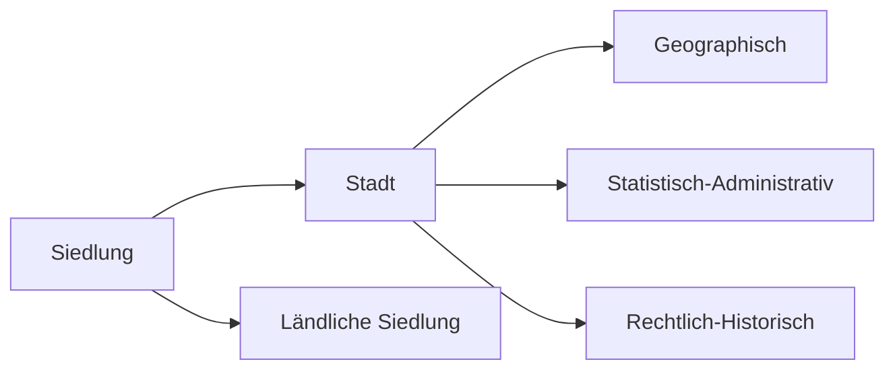

# Bevölkerungsentwicklung und Verstädterung

> Verstädterung beschreibt zunächst die zunehmende Konzentration von Menschen in städtischen Gebieten. Kann durch eines der drei Faktoren zum Ausdruck kommen:
> 1. Im Wachstum der der Städte eines Gebietes oder Landes hinsichtlich der Einwohnerzahl und/oder Fläche
> 2. In der Zunahme städtischer Siedlungen innerhalb eines Gebietes oder Landes
> 3. In der Zunahme des Anteils der Menschen an der Gesamtbevölkerung, die in Städten leben.

## Demographischer Übergang

Erster Demographischer Übergang

Zweiter Demographischer Übergang

## Auswirkung des Bevölkerungswachstums

**Folgen eines starken Bevölkerungswachstums in Entwicklungsländern**
- Sinkende Sparleistung und sinkende Kaufkraft
- das Wirtschaftswachstum wird gebremst
- sinkende Nachfrage nach Wirtschaftsgütern
- zunehmende Arbeitslosigkeit und Unterbeschäftigung
- Veränderung der Altersstruktur durch stärkere Zunahme der jüngeren Bevölkerungsanteile
- höhere Versorgungslasten für die arbeitende Bevölkerung
- sinkendes Pro-Kopf-Einkommen und sinkender Lebensstandart
- steigende Kosten für das Bildungswesen

**Demographische Alterung**

## Prozess der Verstädterung

**Grundbegriffe**
- Verstädterung - Vergrößerung/Ausdehnung von Städten
- Urbanisierung - Ausbreitung von Städten auch aus sozialen oder ökonomischen Aspekten
- Pushfaktoren - Faktoren, die einen von etwas weg ziehen, Bsp. Keine Arbeit
- Pullfaktoren - Faktoren, die einen in die Städte ziehen, Bsp. Infrastruktur

**Der geographische Stadbegriff**
- Stadt - Verwaltungsrechtlich bestimmte Siedlungseinheit, die durch eine Stadtgrenze definiert ist
- Zentralität - Bedeutungsüberschuss einer Stadt gegenüber ihrem Umland

## Unterschiede beim Stadtwachstum zwischen Entwicklungs- und Industrieländern

| Entwicklungsland                                      | Industrieland                                                                                        |
| ----------------------------------------------------- | ---------------------------------------------------------------------------------------------------- |
| Push: niedriege Lebensstandarts                       | Push: Attraktionslosigkeit auf dem Land (Arbeitslosigleit, Extreme soziale Gegensätze, kaum Bildung) |
| Push: Arbeitslosigkeit                                | Pull: Teilnahme am sozialen Leben                                                                    |
| Pull: Attraktive Strukturmerkmale im Städtischem Raum | Push: Demographischer Wandel                                                                         |
| Pull: Medien                                          | Pull: Infrastruktur und öffentliche Einrichtungen                                                                                                     |

