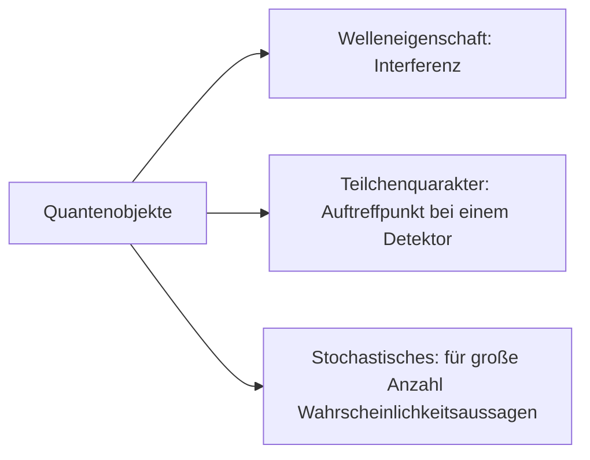

# Quantenphysik

$E_{\text{ph}}=h\cdot f_{g}$
$E_{\text{ph}}=f\cdot f_{uv}$
$f_{g}<f_{uv}$
$E_{\text{ph, gelb}}<E_{\text{ph, uv}}$

## Fotoeffekt

Als äußeren photoelektrischen Effekt bezeichnet man das Herauslösen von Elektronen aus einer Halbleiter- oder Metalloberfläche durch Bestrahlung.

## Modelle für das Licht

| Modell Lichtstrahlen                                         | Modell Wellen                                          | Modell Teilchen                            |
| ------------------------------------------------------------ | ------------------------------------------------------ | ------------------------------------------ |
| Eignet sich zur Beschreibung des Wegs, den Licht zurücklegt. | Eignet sich zu Erklärung von Beugung und Interferenz. | Eignet sich zur Erklärung des Fotoeffekts. |
| Keine Aussage zur Natur des Lichts                           | Licht hat Wellencharakter                              | Licht hat Teilchencharakter                |

## Energie eines Photons

$h$ planksches Wirkungsquantum mit $6.626\cdot10^{-34}Js$
$f$ Frequenz
$$E_\text{ph}=h\cdot f=h\cdot \frac{c}{\lambda}$$

Energie mehrere Photonen
$n$ Anzahl Photonen
$$E=n\cdot h\cdot f=n\cdot h\cdot \frac{c}{\lambda}$$

### Äußere lichtelektrischer Effekt im Photonenmodell

$E_{\text{ph}}=W_{A}+E_{\text{kin}}$

### Energiebilanz

### Gegenfeldmethode

- Regelbare Spannungsquelle ist zwischen Kathode und Anode angeschlossen
- Gegenspannung an der regelbaren Spannungsquelle wird so eingestellt, dass die Stromstärke null ist ($I=0$)
- Mithilfe der Gegenspannung U kann die kinetische Energie der herausgelösten Elektronen bestimmt werden: $E_\text{kin}=e\cdot U$

### Einstein-Gerade

Anstieg der Einstein-Gerade ist das plancksche Wirkungsquantum $h$.

$E_\text{ph}=E_\text{kin}+W_{A}$
$E_{\text{kin}}(f)=W_{A}+h\cdot f\to m+n\cdot x$

### Impuls-Photon

$E=m\cdot c^{2}$
$E=h\cdot f$

$m\cdot c^{2}=h\cdot f$
$mc=h\cdot \frac{f}{c}$
$$p=h\cdot \frac{f}{c}=\frac{h}{\lambda}$$

$$m=\frac{h\cdot f}{c^{2}}$$

## Materiewellen

### De-Broglie-Wellenlänge

$$\lambda=\frac{h}{p}=\frac{h}{m\cdot v}$$

### Leuchtdiode

Umkehrung des lichtelektrischen Effekts.

- Elektronen und Löcher: In einem Halbleitermaterial, wie zum Beispiel Silizium, gibt es Elektronen, die sich frei bewegen können, sowie "Löcher", die durch fehlende Elektronen entstehen. Diese Elektronen und Löcher tragen zur elektrischen Leitfähigkeit des Materials bei.
- Dotierung: Um eine LED herzustellen, wird der Halbleiter mit bestimmten Fremdatomen dotiert, um die Elektronen- und Lochträgerkonzentration zu verändern. Bei einer speziellen Art von LEDs, den Galliumarsenid-LEDs beispielsweise, werden Gallium- und Arsenatome verwendet.
- Rekombination: Wenn eine Spannung an die LED angelegt wird, werden Elektronen und Löcher durch den Halbleiter bewegt. Wenn Elektronen auf Löcher treffen, können sie rekombinieren, wobei Energie freigesetzt wird.
- Energieemission: Die freigesetzte Energie manifestiert sich in Form von Licht. Die Farbe des Lichts hängt von der Bandlücke des Halbleitermaterials ab. Die Bandlücke ist die Energielücke zwischen dem Valenzband und dem Leitungsband des Materials.

## Vergleich makroskopischer Objekte und Quantenobjekte

Für makroskopische Objekte überlagern sich die Häufungsbereiche der einzelnen Spalte. 

Für viele Quantenobjekte ergibt sich ein Interferenzmuster. Für wenige ergibt sich kein Muster (kein gesetzmäßige Zusammenhang).

Bei makroskopischen Objekten kann man vorhersagen durch welchen Spalt das Objekt geht. Bei Quantenobjekten ist keine Vorhersage möglich.

| markroskopische Objekte                                                    | Quantenobjekte                                                                                                         |
| -------------------------------------------------------------------------- | ---------------------------------------------------------------------------------------------------------------------- |
| bewegen sich auf konkreten Bahnen                                          | bewegen sich nicht auf Bahnen                                                                                          |
| Anzahl der Objekte ändert nichts an der Vorhersagbarkeit eines Ergebnisses | Geringe Anzahl kann man keine Anzahl treffen, bei vielen Wahrscheinlichkeitsaussagen möglich                           |
| Ort und Impuls sind an den Grenzen der Messgenauigkeit bestimmbar          | Je genauer der Ort eines Quantenobjektes bestimmt wird, desto ungenauer kann der Impuls bestimmt werden und umgekehrt. |

### Komplementaritätsprinzip

> Ortsmessung und Interferenzerscheinungen sich nicht gleichzeitig realisierbar. Sie schließe sich gegenseitig aus.

## Heisenbergsche Unschärfenrelation

$\Delta x$ Ortsunschärfe
$\Delta p$ Impulsunschärfe
$$\Delta x\cdot\Delta p\ge \frac{h}{4\pi}$$

## Vergleich Photon & Elektron

| Eigenschaft     | Photon                                                                                                                                               | Elektron                                                                        |
| --------------- | ---------------------------------------------------------------------------------------------------------------------------------------------------- | ------------------------------------------------------------------------------- |
| Masse           | ruhe Masse 0, da es sich mit Lichtgeschwindigkeit bewegt, besitzt es eine Masse (relativistische Effekte)                                            | ruhe Masse $\approx9.1\cdot10^{-31}kg$                                          |
| Geschwindigkeit | Bewegt sich mit Lichtgeschwindigkeit                                                                                                                 | Elektron kann jede Geschwindigkeit zwischen 0 und Lichtgeschwindigkeit annehmen |
| Energie         | Energie für bestimmte Frequenz konstant                                                                                                              | Energie abhängig von der Geschwindigkeit                                        |
| Ladung          | Besitzt keine Ladung                                                                                                                                 | Einfach negativ geladen                                                         |
| Ablenkbar       | Kann in elektrischen Feldern nicht abgelenkt werden                                                                                                  | Kann in elektrischen Feldern abgelenkt werden (Lorentz-Kraft)                   |
| Wechselwirkung  | Ist elektromagnetische Strahlung -> ist "Träger" von magnetischen und elektrischen Feldern und somit "Träger" von elektromagnetischer Wechselwirkung | Wechselwirkung mit anderen geladenen Teilchen aufgrund der Ladung               |

# Atommodell

## Frühere Atommodelle

### Griechische Atomisten

- Physik als Intellektuelle Auseinandersetzung
- Idee der Atome von Leukipp und Demokrit
- Atomos -> "Das Unteilbare"
- Atome galten als kleinste mögliche Bausteine und existierten Ewig
- Eigenschaften von Materie durch ihre Atome erklären

### Atome bei John Dalton

- systematische und quantitative Untersuchungen
- Elemente verbinden sich nur vollständig bei einfachen Masseverhältnissen
- Jedes Element besteht aus kleinsten unteilbaren Atomen
- Atome haben eine typische Masse
- Für eine Reihe von Molekülen hat er mögliche Kombination angegeben

### Atomaufbau nach J. J. Thomson

- Experimentierte mit Kathodenstrahlröhrschen
- Wies nach, dass Strahlung aus negativ geladenen Teilchen bestand
- Atommodell bestand aus positiver Masse, in der sich negative Elektronen befanden

### Rutherfords Atommodell

- konnten mithilfe von Alphateilchen die Bahnen rekonstruieren
- Eins von etwa 8000 Teilchen entsprach jedoch nicht der gedachten Bahn
- Die Bahnen wurden mit einem neuen Atommodell begründet
- Atome waren weitgehend leer
- Im Zentrum befindet sich ein kleiner kompakter Kern
- Deutlich leichtere Elektronen umkreisen den Atomkern
- Da Elektronen geladen sind, müssten sie Strahlung abgeben, wodurch sie Energie verlieren und in den Kern stürzen müsste
- Boor löste dieses Problem, indem die Elektronen sich auf festen Bahnen um den Kern bewegen, auf denen sie keine Energie verlieren

## Bohrsches Atommodell

### Postulate

1. Es existieren stabile Bahnen, auf denen die Elektronen kreisen, ohne Strahlung auszusenden.
2. Es sind nur Bahnen erlaubt, für die gilt:

 $m$ Masse Elektronen
 $v$ Geschwindigkeit Elektronen
 $r$ Bahnradius
 $n$ Bahnnummer ($n\in\mathbb{N}, n>0$)
$$m\cdot v\cdot r=n \frac{h}{2\pi}$$

Herleitung
$2\pi r=n\lambda$
$\lambda=\frac{h}{mv}$

Einsetzen
$\frac{nh}{mv}=2\pi r$
$n\frac{h}{2\pi}=mvr$

3. Die Emissionen oder Absorption von Photonen erfolgt genau dann, wenn ein Elektron von einer erlaubten Bahn auf eine andere erlaubte Bahn wechselt.
4. Jeder erlaubten Elektronenbahn entspricht eine bestimmte Energie der Elektronen. Wechselt ein Elektron die Bahn, so ist die Energie emittierten bzw. absorbierten Photons gleich der Energiedifferenz der Bahnenergien.

$$\Delta E=h\cdot f$$

### Bohrscher Radius

Elektron bewegt sich auf Kreisbahn: Radialkraft notwendig! $F_{r}=m \frac{v^{2}}{r}$
Coulombkraft ist hier die Radialkraft: $m \frac{v^{2}}{r}=\frac{1}{4\pi\epsilon_{0}\epsilon} \frac{qQ}{r^{2}}$

Für die Beträge gilt: $q=Q=e$

$m \frac{v^{2}}{r}=\frac{1}{4\pi\epsilon_{0}\epsilon}\cdot \frac{e^{2}}{r^{2}}$

Das 2. Bohrsches Postulat einsetzen
$mvr=n\cdot \frac{h}{2\pi}\to v=\frac{n\cdot h}{mr2\pi}\to m \frac{n^{2}h^{2}}{m^{2}r^{2}4\pi^{2}r}=\frac{1}{4\pi\epsilon_{0}\epsilon} \frac{e^{2}}{r^{2}}$
$\frac{n^{2}h^{2}}{m \pi r}=\frac{1}{\epsilon_{0}\epsilon}e^{2}$
$r=\frac{n^{2}h^{2}\epsilon_{0}\epsilon}{m\pi e^{2}}$
2
Da Bohrscher Radius $n=1$ und kein Stoff sich zwischen Atomen befindet, gilt:
$r=\frac{h^{2}\epsilon_{0}}{m\pi e^{2}}$
$r=\frac{(6.626\cdot10^{-34}Js)^{2}\cdot8.854\cdot10^{-12}\frac{As}{Vm}}{9.109\cdot10^{-31}kg\cdot\pi\cdot(1.602\cdot10^{-19}As)^{2}}=5.29\cdot10^{-11}m$

$1 \dot{A}=1 \mathrm{Angström}=100pm=0.1nm$
Bohrscher Radius $\approx0.05nm\approx \frac{1}{2}\dot{A}$

### Energieniveau im bohrschen Atommodell

$E_{\text{ges}}=E_{\text{kin}}+E_{\text{pot}}$
$\lim_\limits{r\to\infty}E_{\text{pot}}=0$
(Elektron hat sich vom Atom gelöst)

$E_{\text{kin}}=\frac{m}{2}v^{2}$
$F_{\text{Coloumb}}=F_{R}\Rightarrow \frac{1}{4\pi\epsilon_{0}} \frac{e^{2}}{r^{2}}=m \frac{v^{2}}{r}\Rightarrow mv^{2}=\frac{1}{4\pi\epsilon_{0}} \frac{e^{2}}{r}$

Kraft in Energie einsetzen
$E_{\text{kin}}=\frac{1}{2} \frac{1}{4\pi\epsilon_{0}} \frac{e^{2}}{r}=\frac{1}{8\pi\epsilon_{0}} \frac{e^{2}}{r}$
$W_{R}=\Delta E_{\text{pot}}=E_{\text{pot}}(r)-E_{\text{pot}}(\infty)=E_{\text{pot}} (r)-0=E_{\text{pot}}(r)$
$\begin{split}W_{R}&=E_{\text{pot}}(r)=\displaystyle\int_{\infty}^{r}F\mathrm{d}s\\ &=\displaystyle\int_{\infty}^{r} \frac{1}{4\pi\epsilon_{0}} \frac{e^{2}}{s^{2}}\mathrm{d}s=\frac{e^{2}}{4\pi\epsilon_{0}} \displaystyle\int_{\infty}^{r} \frac{1}{s^{2}}\mathrm{d}s\\ &=\frac{e^{2}}{4\pi\epsilon_{0}}[-s^{-1}]_{\infty}^{r}=\frac{e^{2}}{4\pi\epsilon_{0}} \lim_{b\to\infty}(- \frac{1}{r}+ \frac{1}{b})\\ &=\frac{-e^{2}}{4\pi\epsilon_{0}} \frac{1}{r}(<0)\end{split}$

$E_{\text{ges}}$ ergibt sich aus potentieller und kinetischer Energie
$E_{\text{ges}}=E_{\text{kin}}+E_{\text{pot}}=\frac{e^{2}}{8\pi\epsilon_{0}} \frac{1}{r}- \frac{e^{2}}{4\pi\epsilon_{0}} \frac{1}{r}=- \frac{e^{2}}{8\pi\epsilon_{0}} \frac{1}{r}$

$r=\frac{h^{2}\epsilon_{0}}{\pi e^{2}m}n^{2}$ in $E_{\text{ges}}$ einsetzen
$E_{\text{ges}}=- \frac{e^{2}}{8\pi\epsilon_{0}} \frac{1}{\frac{h^{2}\epsilon_{0}}{\pi e^{2}m}n^{2}}$
$E_{\text{ges}}=- \frac{e^{4}\pi m}{8\pi\epsilon_{0}^{2}h^{2}} \frac{1}{n^{2}}=-\frac{e^{4}m}{8\epsilon_{0}^{2}h^{2}}\cdot\frac{1}{n^{2}}$

### Serienformel für Wasserstoff

Geht ein Elektron von der $m$-ten auf die $n$-te Bahn (Zustand) über mit $m>n$, dann wird ein Photon mit der Energie $E_{\text{ph}}=E_{m}-E_{n}$ ausgestrahlt.

$E_{\text{ph}}=-\frac{e^{4}m}{8\epsilon_{0}^{2}h^{2}}\cdot(\frac{1}{m^{2}}- \frac{1}{n^{2}})=\frac{e^{4}m}{8\epsilon_{0}^{2}h^{2}}\cdot(\frac{1}{n^{2}}- \frac{1}{m^{2}})$
$E_{\text{ph}}=h\frac{e^{4}m}{8\epsilon_{0}^{2}h^{3}}(\frac{1}{n^{2}}- \frac{1}{m^{2}})$

$R_{H}=\frac{e^{4}m}{8\epsilon_{0}^{2}h^{3}}=3.2898\cdot10^{15}Hz$

$E_\text{ph}=h\cdot f=h\cdot R_{H}(\frac{1}{n^{2}}- \frac{1}{m^{2}})$
$f=\frac{E_{\text{ph}}}{h}=R_{H}(\frac{1}{n^{2}}- \frac{1}{m^{2}})$

$$f=R_{H}(\frac{1}{n^{2}}- \frac{1}{m^{2}})$$

### Energieniveauschema

#### Serien

Lyman Serie
$E_{2\to 1}=1.63489\cdot10^{-18}J=10.204eV$
$E_{3\to1}=1.93765\cdot10^{-18}J=12.0937eV$
$E_{4\to1}=2.04361\cdot10^{-18}J=12.755eV$
$E_{\infty\to1}=2.17985\cdot10^{-18}J=13.6eV$

$E=hf=h \frac{c}{\lambda}$
$\lambda=\frac{hc}{E}$

$\lambda_{2\to1}=121.588nm$
$\lambda_{3\to1}=102.59nm$
$\lambda_{4\to1}=97.2705nm$
$\lambda_{\infty\to1}=91.1911nm$

Balmer-Serie
$\lambda_{3\to2}=656.57nm$
$\lambda_{4\to2}=486.352nm$
$\lambda_{\infty\to2}=364.764nm$

Paschen-Serie für $n=3$

Serien sind immer für Strahlung die Entsteht, wenn ein Elektron von einem höherem auf ein niedrigeres Niveau geht.

#### Möglichkeiten & Grenzen des bohreschen Atommodells

Möglichkeiten
- Ermöglicht eine Abschätzung des Atomradius
- Spektrallinien für Wasserstoff können berechnet werden
- Führt quantentheoretische Erkenntnisse in die Atomtheorie ein (Emission & Absorption von Licht)

Grenzen
- Widerspruch von diskreten Bahnen (Kreisbahnen) zur Quantentheorie (Quantenteilchen bewegen sich nicht auf konkreten Bahnen)
- Modell versagt bei Vorhersagen für Atome mit mehr als einem Elektron (nur Wasserstoffatom beschreibbar)
- Postulate erscheinen willkürlich (Elektronen senden keine Strahlen aus)

## Quantenmechanisches Atommodell

### Schrödinger Gleichung

$i$ imaginäre Einheit (komplexe Zahlen)
$\Psi$ Wellenfunktion oder Zustandsfunktion eines Quantenteilchens
$\hat{H}$ Hamiltonoperator (gibt Energieinformation und Zeitentwicklung eines quantenmechanischen Systems an)
$$i \frac{h}{2\pi} \frac{\partial \Psi}{\partial t}=\hat{H}\Psi$$

### Zustandsfunktion

 - Ein System wird durch die Zustandsfunktion $\Psi$ beschrieben
 - Aussagen über Ort und Impuls (Geschwindigkeit) eines Teilchens zu einem bestimmten Zeitpunkt sind in der Zustandsfunktion enthalten
 - Wahrscheinlichkeit, dass ein Quantenobjekt in einem gewissen Ortsbereich nachgewiesen werden kann, ist direkt proportional zum Betragsquadrat der Zustandsfunktion ($|\Phi|^{2}$)

#### Unendlich tiefer eindimensionaler Potenzialtopf

Modell für gebundene Objekte:
- Elektronen können sich nur in einem Bereich entlang der x-Achse frei bewegen($0<x<L$)
- Diese Einschränkung führt zu diskreten Energieniveaus

Energieniveaus

$mv=p=\frac{h}{\lambda}$
$L=\frac{n}{2}\lambda\quad n\in\mathbb{N}$
$E=\frac{m}{2}v^{2}=\frac{m^{2}v^{2}}{2m}=\frac{p^{2}}{2m}=\frac{h^{2}}{2m\lambda^{2}}=\frac{h^{2}n^{2}}{2m4L^{2}}=\frac{h^{2}}{8mL^{2}}n^{2}$

Energie des Grundzustandes
$E_{1}=\frac{h^{2}}{8mL^{2}}$

Energieniveau
$E=E_{1}n^{2}$

Lösen der Schrödinger Gleichung führt zu folgender Zustandsfunktion:
$\Phi_{n}(x)\sim\sin{(\frac{n\pi}{L}x)}$

### Schalenmodell / Orbitalmodell

Zustände werden über "stehende Wellen" definiert → Lösungen der Schrödinger Gleichung

Einer vorgegebenen Hauptquantenzahl $n$ kann man $2n^{2}$ verschiedene Kombinationen aus $n,l,m$ und $s$ zuordnen → Anzahl Elektronen pro Schale

#### Pauli-Prinzip

In einem Atom können niemals mehrere Elektronen in allen Quantenzahlen übereinstimmen.

#### Quantenzahlen

| Quantenzahl                   | Bedeutung                                       | Mögliche Werte      |
| ----------------------------- | ----------------------------------------------- | ------------------- |
| Hauptquantenzahl $n$          | Energieniveau in Atomhülle bzw. Schale          | $n=0,1,2,\dots$     |
| Bahndrehimpulsquantenzahl $l$ | Kennzeichnet das Orbital                        | $l=0,1,2,\dots,n-1$ |
| Magnetquantenzahl $m$         | Kennzeichnet Orbitale nach Orientierung im Raum | $m=-l,\dots,+l$     |
| Spinquantenzahl $s$           | Richtung der Eigenrotation des Elektrons        | $s=\pm \frac{1}{2}$ |

#### Elektronenkonfiguration

**Beispiele**
Lithium $1s^{2}2s^{2}$
In der ersten Schale beim s-Orbital 2 Elektronen

Magnesium $1s^{2}2s^{2}2p^{6}3s^{2}$
12 Elektronen gesamt

## Franck-Hertz-Experiment

- Durchgeführt von James Franck und Gustav Hertz (1911-1914)

**Interpretation**
Durch die Beschleunigungsspannung $U_{B}$ werden die Elektronen von der Kathode bis zur Anode beschleunigt. Ab einer gewissen Spannung $U_{B}$ stoßen die Elektronen unelastisch mit den $Hg$-Atomen zusammen. Dadurch werden von den $Hg$-Atomen von dem Grundzustand in den nächst höheren Energiezustand gehoben. Wenn diese wieder in den Grundzustand zurückfallen, werden Photonen ausgesendet (Gas leuchtet).
Freie Elektronen, die durch unelastische Stöße mit dem $Hg$-Atomen Energie abgeben haben, besitzen nicht genug kinetische Energie, um die Gegenspannung zu überwinden. Dadurch kommen weniger Elektronen an der Anode an und die Stromstärke sinkt.

## Resonanzabsorption und Lumineszenz

Resonanzabsorption
- Bei Bestrahlung mit weißem Licht wird ein Atom von Photonen unterschiedlichster Frequenz bzw. Energie getroffen
- Das Atom kann ein Photon nur dann absorbieren wenn dessen Energie genau der Differenz zwischen zwei Atomaren Energieniveaus $E_{1}$ und $E_{2}$ entspricht
- $E_{\text{ph}}=h\cdot f=E_{2}-E_{1}$

Lumineszenz
- Das Photon der Resonanzabsorption wird für eine gewisse Zeit gespeichert
- Beim Übergang in ein niedrigeres Energieniveau wird das Photon wieder ausgesendet

Fluoreszenz
- Bestrahlung mit Licht
- Emittiertes Licht hat selbe Frequenz wie absorbiertes Licht
- Innerhalb von $10^{-8}s$

Phosphoreszenz
- Prozess deutlich Länger

Frequenzänderung bei Lumineszenz
- Beim Aussenden des Photons bleibt ein Teil der Energie im Atom zurück
- Da das Photon mit weniger Energie emittiert wird, ist die Frequenz auch kleiner

### Emissionsspektrum

- Nur die emittierte Frequenz ist sichtbar, alle anderen Teile des Spektrums sind schwarz

### Absorptionsspektrum

- Nur die absorbierte Frequenz ist schwarz, alle anderen Teile des Spektrums sind sichtbar

## Laser

### Funktionsprinzip Laser

Spontane Emission: Emission eines Photons erfolgt spontan nach einer nicht genau bestimmten Zeit.

Stimulierte/Induzierte Emission: Emission eines Photons wird durch ein Photon mit gleicher Wellenlänge ausgelöst.

Wirkungsweise
- Energiequelle bringt Atome des aktiven Mediums (= Lasermedium) in einem angeregten Zustand
- durch spontane Emission werden Photonen ausgesendet
- diese Photonen lösen durch stimulierte weitere Photonen aus
- an den Spiegeln werden die Photonen reflektiert und verstärken somit die induziert Emission
- ein Teil der Photonen verlässt das aktive Medium als Laserstrahlung durch den halbdurchlässigen Spiegel

### Eigenschaften Laserstrahlung

- ist paralleles Licht
- besitzt eine hohe Leistungsdichte
- ist monochromatisch (besitzt bestimmte Frequenz)
- ist vollständig polarisiert
- ist kohärentes Licht

Durch stimulierte (induzierte) Emission werden Photonen erzeugt, die in Bewegungsrichtung, Phasenbeziehung und Frequenz mit anderen zuvor ausgelösten Photonen übereinstimmen.

Besetzungsinversion:
- Je höher die Energie eines Zustands, umso geringer ist die Besetzungswahrscheinlichkeit
- Für Lichtverstärkung muss die Mehrheit der Atome in höhere Energieniveaus befördert werden
- Obere Laserniveaus sind relativ langlebig und werden somit durch spontane Übergänge nicht abgebaut
- Untere Laserniveaus sind relativ kurzlebig, wodurch die Laserstrahlung nicht durch Absorption stark abgeschwächt wird
